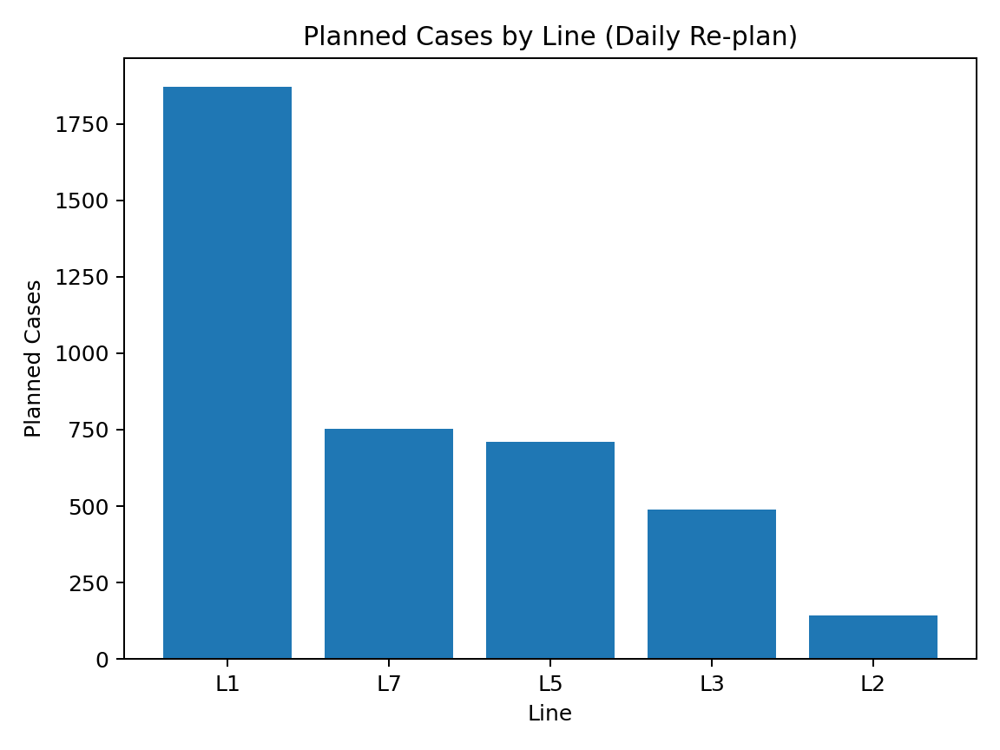
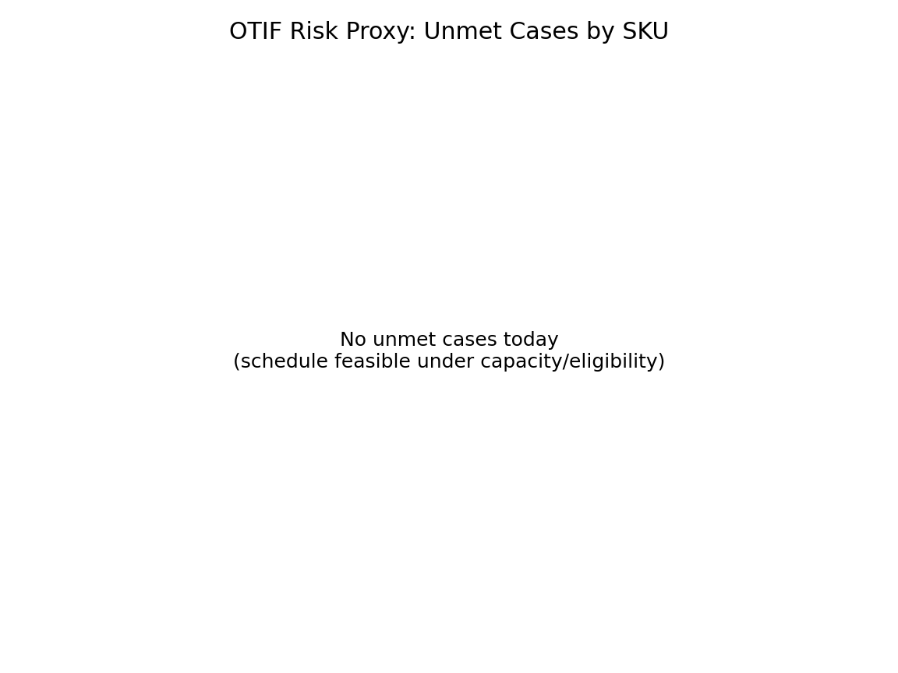

# Supply Chain Planning Analyst II (Niagara-Style) — Daily Production Planning & MRP (6+ Lines)

This portfolio project simulates a **bottled water plant** planning role aligned with Niagara’s **Supply Chain Planning Analyst II**: producing **daily production plans**, maintaining **planning parameters**, ensuring **MRP drives accurate material requirements**, and enforcing **inventory policy adherence** across **6+ production lines**.

---

## JD Alignment (mapped to Niagara responsibilities)

### Produce production plans & revise schedule daily (6+ lines)
- Output: `results/daily_production_schedule.csv`
- Includes: line eligibility/capacity, changeover minutes, unmet demand flags (exception-based planning)

### Monitor & adjust forecasts; improve demand planning efficiency
- Output: `results/forecast_override_log.csv`
- Provides an audit trail (who/why) for forecast adjustments (promo, customer add-ons, trend breaks)

### Ensure MRP drives accurate raw material requirements
- Outputs:
  - `results/mrp_requirements.csv` (MRP explode requirements)
  - `results/mrp_exception_report.csv` (shortage + earliest ETA + suggested actions)

### Inventory policy adherence (Min/Target/Max DOS)
- Output: `results/inventory_policy_adherence.csv`
- Calculates DOS and recommends production quantities to maintain policy compliance

### Cross-functional interface (Ops, Purchasing, Sales/CS, Transportation)
- Ops executes schedule; Purchasing acts on shortages/ETAs; CS/Sales manage priorities; Transportation aligns ship windows/cutoffs (simplified)

---

## Deliverables (outputs)

Generated under `results/`:
- `daily_production_schedule.csv` — daily re-plan schedule (Line × SKU) + flags + changeover minutes  
- `plan_by_sku_day.csv` — short-horizon plan (SKU/day) used for MRP explode  
- `mrp_requirements.csv` — material requirements by date  
- `mrp_exception_report.csv` — shortages + ETA + suggested actions (expedite / re-sequence / substitute)  
- `inventory_policy_adherence.csv` — DOS Min/Target/Max + recommended production quantities  
- `forecast_override_log.csv` — forecast override log (reason/owner)  
- Charts:
  - `results/charts/line_load.png`
  - `results/charts/otif_risk.png`

### Quick visuals



---

## Plant model (Niagara-style assumptions)

- **Single plant** with **8 production lines** (meets “6+ lines” complexity)
- Each line has: rate (cases/hr), shift hours, downtime, eligible SKUs
- Water SKUs: bottle size × pack × resin (PET/HDPE)
- Materials (MRP): PREP (preform), CAP, LABEL, CARTON, FILM, PALLET

---

## How to run

```bash
python -m pip install -r requirements.txt

python src/01_generate_mock_data.py --out_dir data
python src/03_daily_scheduler.py --data_dir data --results_dir results
python src/02_mrp_explode.py --data_dir data --results_dir results
python src/04_reports_and_charts.py --data_dir data --results_dir results

# Niagara-Style Daily Production Planning & MRP Control Tower (6+ Lines)

**Goal (JD-aligned):** Create and execute daily production plans, maintain planning parameters, monitor/adjust forecasts, ensure MRP drives accurate material needs, and enforce inventory policy adherence — while coordinating across Manufacturing, Purchasing, Sales/CS, and Transportation.

## What this repo produces (deliverables)
- `results/daily_production_schedule.csv` — **daily re-plan** schedule (line × SKU) with capacity/eligibility flags
- `results/plan_by_sku_day.csv` — short-horizon production plan by SKU/day (input to MRP explode)
- `results/mrp_requirements.csv` — materials requirements by date (MRP explode output)
- `results/mrp_exception_report.csv` — material shortages + ETA + suggested actions (for Purchasing/Ops)
- `results/inventory_policy_adherence.csv` — DOS / Min-Target-Max / recommended production quantities (policy adherence)
- `results/forecast_override_log.csv` — example override log (audit trail)
- `results/charts/line_load.png`, `results/charts/otif_risk.png`

## How to run
From repo root:
```bash
python -m pip install -r requirements.txt
python src/01_generate_mock_data.py --out_dir data
python src/03_daily_scheduler.py --data_dir data --results_dir results
python src/02_mrp_explode.py --data_dir data --results_dir results
python src/04_reports_and_charts.py --data_dir data --results_dir results
```

## Niagara-style operating cadence
**Daily re-plan loop**
1. **Customer Service / Sales**: order adds/changes + priority updates
2. **Planning**: run daily re-plan → publish schedule + exception list
3. **Purchasing**: act on `mrp_exception_report.csv` (expedite/substitute)
4. **Manufacturing/Ops**: execute schedule; escalate constraints; update downtime/rates
5. **Transportation**: verify ship windows / load capacity; align on cutoffs

## Notes
This is a heuristic scheduler intended for a portfolio project. In a production system, you would add:
- frozen window rules, WIP, labor/crew constraints
- multi-day sequencing, maintenance windows, and richer changeover families
- transportation load building (palletization, full truck vs LTL)
